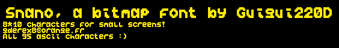

# Snano ASCII font

## A 8*10 bitmap font

This is a font I drew myself for a project on a microcontroller with a small screen. Each character is 8 pixels wide and 10 pixels high. Each pixel is a bit, either on or off. Each character actually takes pixels because of the padding. Only the 95 displayable characters of the 7 ascii standard are drawn.

This repository comes (will come) with a few scripts to convert the font to useful formats for your own project.

The font WILL change as I use it in different things and find visual flaws. This is my first time making a font so things are very naïve.

## License

There's no real license for this font, just mention my name when using it and don't use it for commercial projects except if I allowed it.

## All characters

